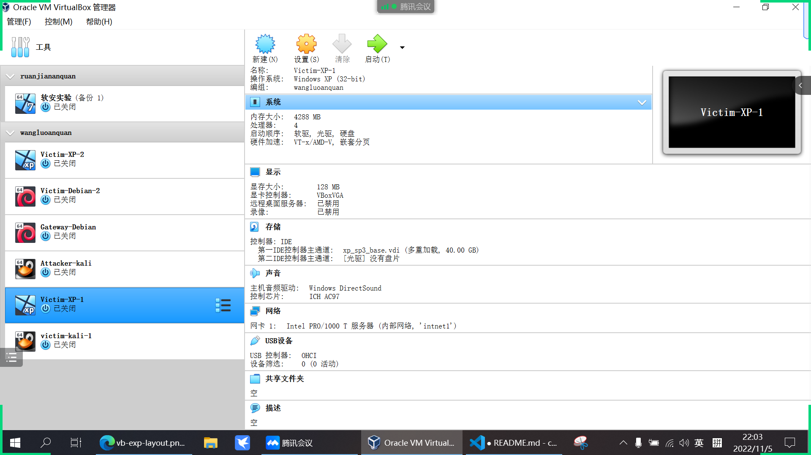
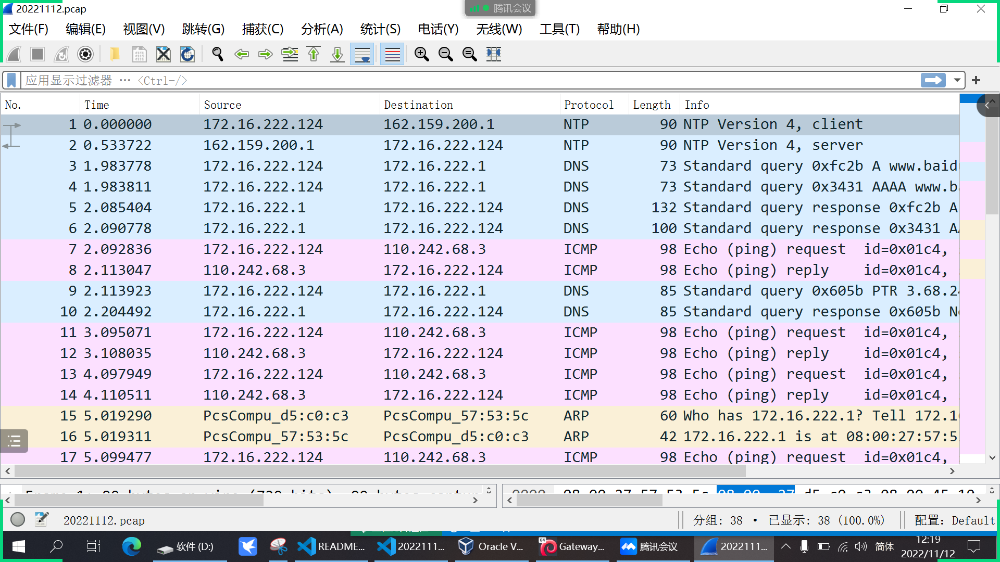

# 基于 VirtualBox 的网络攻防基础环境搭建

## 实验目的

- 掌握 VirtualBox 虚拟机的安装与使用；

- 掌握 VirtualBox 的虚拟网络类型和按需配置；

- 掌握 VirtualBox 的虚拟硬盘多重加载；

## 实验环境

- VirtualBox 虚拟机
- 攻击者主机（Attacker）：-Kali Rolling 2019.2
- 网关（Gateway, GW）：Debian Buster
- 靶机（Victim）：From Sqli to shell / xp-sp3 / Kali

## 实验要求

- 虚拟硬盘配置成多重加载
    - 管理-->虚拟介质管理-->选中.vdi文件进行释放-->在属性界面，将类型修改为多重加载
        
    - 选中虚拟机-->设置-->存储-->控制器-->添加虚拟硬盘-->选中虚拟硬盘
        
    - 效果如下
           

- 搭建满足如下拓扑图所示的虚拟机网络拓扑
    - 网关网络配置如下
        
    - 攻击者网络配置如下
        
    - Internet1下主机网络配置如下
        
    - Internet2下主机网络配置如下
        
```
XP:ipconfig
Debian:ip a
kali:ifconfig
```
|      主机       |       IP       |
| :-------------: | :------------: |
|   Victim-XP-2   | 172.16.222.148 |
| Victim-Debian-2 | 172.16.222.124 |
| Gateway-Debian  |  172.16.111.1  |
|  Attacker-kali  |   10.0.2.15    |
|   Victim-XP-1   | 172.16.111.119 |
|  victim-kali-1  | 172.16.111.100 |


- 完成以下网络连通性测试；
    - 靶机可以直接访问攻击者主机
        - internet1
        
        - internet2
        
    - 攻击者主机无法直接访问靶机
        - internet1
        
        - internet2
        
    - 网关可以直接访问攻击者主机和靶机
        - 攻击者主机
        
        - internet1下的主机
        
        - internet2下的主机
        
    - 靶机的所有对外上下行流量必须经过网关
    利用vscode远程连接网关对应的主机，使用指令`tcpdump -i enp0s10 -n -w 20221112.pcap`将抓取到的包放到pcap文件中
    
    在本地用wireshark进行分析,发现对应的ip数据均符合靶机和目标网址等信息。
    
    - 所有节点均可以访问互联网
    
## 实验反思
1. 网关pingXP主机不通时可能因为XP的防火墙未关，处理方法为点击右下角红色❌盾牌，关闭防火墙

成功

2. 使用 `tcpdump -i enp0s9 -n -w 20221112.pcap`对Internet2内的主机抓包时不成功，因为enp0s9是Internet1下的网卡

3. Debian配置远程登录
```
    1.安装ssh服务
    sudo apt-get update #更新软件源
    sudo apt-get install ssh #安装
    2.修改sshd_config文件，命令为：vi /etc/ssh/sshd_config
    将#PasswordAuthentication no的注释去掉，并且将no修改为yes
    将#PermitRootLogin prohibit-password的注释去掉，将prohibit-password改为yes
    PasswordAuthentication yes
    PermitRootLogin yes
    3.启动SSH服务，命令为：/etc/init.d/ssh start
    4.验证SSH服务状态，命令为：/etc/init.d/ssh status
    5.添加开机自启动 update-rc.d ssh enable
```
 
## 参考文献
1. [多重加载](https://blog.csdn.net/jeanphorn/article/details/45056251)
2. [网络配置](http://courses.cuc.edu.cn/course/90732/learning-activity/full-screen#/378195)
3. [Debian查看IP](https://blog.csdn.net/chenjiazhanxiao/article/details/90669266)
4. [kali查看IP](https://blog.csdn.net/weixin_45365048/article/details/103655654)
5. [windowsXP查看IP](https://cn.bing.com/search?q=windowsXP%E5%A6%82%E4%BD%95%E6%9F%A5%E7%9C%8BIP&form=ANNTH1&refig=d7afb8d762ce4820847a81060414e436)