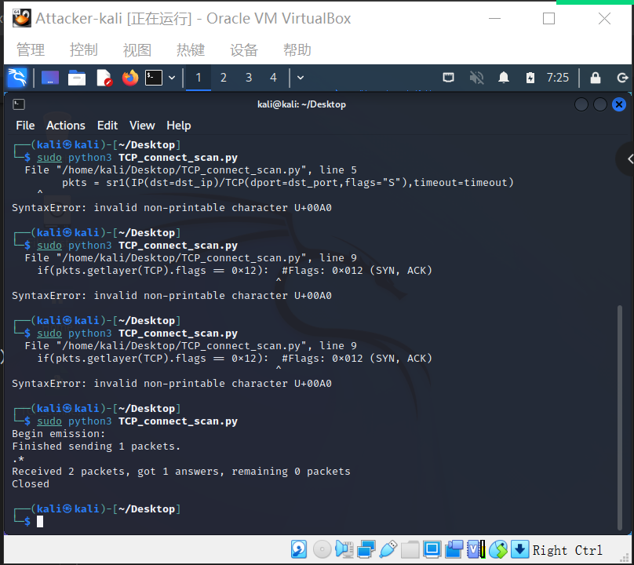
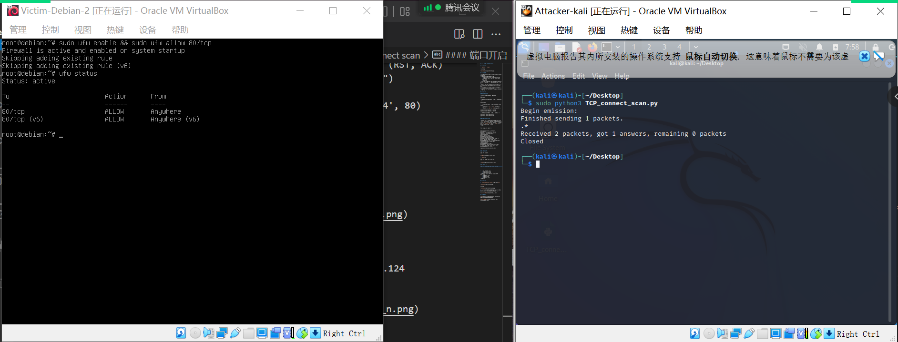

# 基于 Scapy 编写端口扫描器

## 实验环境

- `python` + `scapy`

- 网络拓扑


## 实验要求

- 禁止探测互联网上的 IP ，严格遵守网络安全相关法律法规
- 完成以下扫描技术的编程实现
    - TCP connect scan / TCP stealth scan
    - TCP Xmas scan / TCP fin scan / TCP null scan
    - UDP scan
- 上述每种扫描技术的实现测试均需要测试端口状态为：开放、关闭 和 过滤 状态时的程序执行结果
- 提供每一次扫描测试的抓包结果并分析与课本中的扫描方法原理是否相符？如果不同，试分析原因；
- 在实验报告中详细说明实验网络环境拓扑、被测试 IP 的端口状态是如何模拟的
- （可选）复刻 nmap 的上述扫描技术实现的命令行参数开关

## 实验过程

### 端口状态模拟

- 查看当前防火墙的状态和现有规则
```
ufw status
```
- 关闭状态：对应端口没有开启监听, 防火墙没有开启
```
ufw disable
```
- 开启状态：对应端口开启监听,防火墙处于关闭状态。
    - apache2基于`TCP`, 在`80`端口提供服务; 
    - DNS服务基于`UDP`,在`53`端口提供服务;
```
systemctl start apache2 # port 80
systemctl start dnsmasq # port 53
```
- 过滤状态：对应端口开启监听, 防火墙开启
```
ufw enable && ufw deny 80/tcp
ufw enable && ufw deny 53/udp
```

### TCP connect scan

 先发送一个`S`，然后等待回应。如果有回应且标识为`RA`，说明目标端口处于关闭状态；如果有回应且标识为`SA`，说明目标端口处于开放状态。这时`TCP connect scan`会回复一个`RA`，在完成三次握手的同时断开连接。
- code

```
from scapy.all import *


def tcpconnect(dst_ip, dst_port, timeout=10):
    pkts = sr1(IP(dst=dst_ip)/TCP(dport=dst_port,flags="S"),timeout=timeout)
    if pkts is None:
        print("Filtered")
    elif(pkts.haslayer(TCP)):
        if(pkts.getlayer(TCP).flags == 0x12):  #Flags: 0x012 (SYN, ACK)
            send_rst = sr(IP(dst=dst_ip)/TCP(dport=dst_port,flags="AR"),timeout=timeout)
            print("Open")
        elif (pkts.getlayer(TCP).flags == 0x14):   #Flags: 0x014 (RST, ACK)
            print("Closed")

tcpconnect('172.16.222.124', 80)
``` 

#### 端口关闭
```
sudo ufw disable
```



- `nmap`复刻
```
nmap -sT -p 80 172.16.222.124
```


#### 端口开启
```
sudo ufw enable && sudo allow 80/tcp
```



- `nmap`复刻
```
nmap -sT -p 80 172.16.222.124
```


#### 端口过滤
```
sudo ufw enable && sudo deny 80/tcp
```


- `nmap`复刻
```
nmap -sT -p 80 172.16.222.124
```


### TCP stealth scan

 先发送一个`S`，然后等待回应。如果有回应且标识为`RA`，说明目标端口处于关闭状态；如果有回应且标识为`SA`，说明目标端口处于开放状态。这时`TCP connect scan`会回复一个`RA`，在完成三次握手的同时断开连接。
- code

```
from scapy.all import *


def tcpconnect(dst_ip, dst_port, timeout=10):
    pkts = sr1(IP(dst=dst_ip)/TCP(dport=dst_port,flags="S"),timeout=10)
    if (pkts is None):
        print("Filtered")
    elif(pkts.haslayer(TCP)):
        if(pkts.getlayer(TCP).flags == 0x12):
            send_rst = sr(IP(dst=dst_ip)/TCP(dport=dst_port,flags="R"),timeout=10)
            print("Open")
        elif (pkts.getlayer(TCP).flags == 0x14):   #Flags: 0x014 (RST, ACK)
            print("Closed")
        elif (pkts.getlayer(ICMP)):
            if(int(pkts.getlayer(ICMP).type)==3 and int(stealth_scan_resp.getlayer(ICMP).code)in[1,2,3,9,10,13]):
                print("Flitered")

tcpconnect('172.16.222.124', 80)
``` 

#### 端口关闭
```
sudo ufw disable
```


- `nmap`复刻
```
nmap -sS -p 80 172.16.222.124
```


#### 端口开启
```
sudo ufw enable && sudo allow 80/tcp
```


- `nmap`复刻
```
nmap -sS -p 80 172.16.222.124
```


#### 端口过滤
```
sudo ufw enable && sudo deny 80/tcp
```


- `nmap`复刻
```
nmap -sS -p 80 172.16.222.124
```


### TCP Xmas scan

一种隐蔽性扫描，当处于端口处于关闭状态时，会回复一个RST包；其余所有状态都将不回复。

- code

```
from scapy.all import *


def Xmasscan(dst_ip, dst_port, timeout=10):
    pkts = sr1(IP(dst=dst_ip)/TCP(dport=dst_port, flags="FPU"), timeout=10)
    if (pkts is None):
        print("Open|Filtered")
    elif(pkts.haslayer(TCP)):
        if(pkts.getlayer(TCP).flags == 0x14):
            print("Closed")
    elif(pkts.haslayer(ICMP)):
        if(int(pkts.getlayer(ICMP).type) == 3 and int(pkts.getlayer(ICMP).code) in [1, 2, 3, 9, 10, 13]):
            print("Filtered")


Xmasscan('172.16.222.124', 80)
```

#### 端口关闭
```
sudo ufw disable
```


- `nmap`复刻
```
nmap -sX -p 80 172.16.222.124
```


#### 端口开启
```
sudo ufw enable && sudo allow 80/tcp
```


- `nmap`复刻
```
nmap -sX -p 80 172.16.222.124
```


#### 端口过滤
```
sudo ufw enable && sudo deny 80/tcp
```


- `nmap`复刻
```
nmap -sX -p 80 172.16.222.124
```


### TCP FIN scan
仅发送`FIN`包，`FIN`数据包能够通过只监测`SYN`包的包过滤器，隐蔽性较`SYN`扫描更⾼，此扫描与`Xmas`扫描也较为相似，只是发送的包为`FIN`包，同理，收到`RST`包说明端口处于关闭状态；反之说明为开启/过滤状态。

- code 

```
from scapy.all import *


def finscan(dst_ip, dst_port, timeout=10):
    pkts = sr1(IP(dst=dst_ip)/TCP(dport=dst_port, flags="F"), timeout=10)
    if (pkts is None):
        print("Open|Filtered")
    elif(pkts.haslayer(TCP)):
        if(pkts.getlayer(TCP).flags == 0x14):
            print("Closed")
    elif(pkts.haslayer(ICMP)):
        if(int(pkts.getlayer(ICMP).type) == 3 and int(pkts.getlayer(ICMP).code) in [1, 2, 3, 9, 10, 13]):
            print("Filtered")


finscan('172.16.222.124', 80)
```

#### 端口关闭
```
sudo ufw disable
```


- `nmap`复刻
```
nmap -sF -p 80 172.16.222.124
```


#### 端口开启
```
sudo ufw enable && sudo allow 80/tcp
```


- `nmap`复刻
```
nmap -sF -p 80 172.16.222.124
```


#### 端口过滤
```
sudo ufw enable && sudo deny 80/tcp
```


- `nmap`复刻
```
nmap -sF -p 80 172.16.222.124
```


#### TCP null scan

### TCP NULL scan
发送的包中关闭所有`TCP`报⽂头标记，实验结果预期还是同理：收到`RST`包说明端口为关闭状态，未收到包即为开启/过滤状态.

- code
```
#! /usr/bin/python
from scapy.all import *


def nullscan(dst_ip, dst_port, timeout=10):
    pkts = sr1(IP(dst=dst_ip)/TCP(dport=dst_port, flags=""), timeout=10)
    if (pkts is None):
        print("Open|Filtered")
    elif(pkts.haslayer(TCP)):
        if(pkts.getlayer(TCP).flags == 0x14):
            print("Closed")
    elif(pkts.haslayer(ICMP)):
        if(int(pkts.getlayer(ICMP).type) == 3 and int(pkts.getlayer(ICMP).code) in [1, 2, 3, 9, 10, 13]):
            print("Filtered")


nullscan('172.16.222.124', 80)
```

#### 端口关闭
```
sudo ufw disable
```


- `nmap`复刻
```
nmap -sN -p 80 172.16.222.124
```


#### 端口开启
```
sudo ufw enable && sudo allow 80/tcp
```


- `nmap`复刻
```
nmap -sN -p 80 172.16.222.124
```


#### 端口过滤
```
sudo ufw enable && sudo deny 80/tcp
```


- `nmap`复刻
```
nmap -sN -p 80 172.16.222.124
```


#### UDP scan

### UDP scan
一种开放式扫描，通过发送UDP包进行扫描。当收到`UDP`回复时，该端口为开启状态；否则即为关闭/过滤状态.

- code

```
from scapy.all import *
def udpscan(dst_ip, dst_port, dst_timeout=10):
    resp = sr1(IP(dst=dst_ip)/UDP(dport=dst_port), timeout=dst_timeout)
    if (resp is None):
        print("Open|Filtered")
    elif (resp.haslayer(UDP)):
        print("Open")
    elif(resp.haslayer(ICMP)):
        if(int(resp.getlayer(ICMP).type) == 3 and int(resp.getlayer(ICMP).code) == 3):
            print("Closed")
        elif(int(resp.getlayer(ICMP).type) == 3 and int(resp.getlayer(ICMP).code) in [1, 2, 9, 10, 13]):
            print("Filtered")
        elif(resp.haslayer(IP) and resp.getlayer(IP).proto == IP_PROTOS.udp):
            print("Open")
udpscan('172.16.222.124', 53)
```

#### 端口关闭
```
sudo ufw disable
```


- `nmap`复刻
```
nmap -sU -p 53 172.16.222.124
```


#### 端口开启
```
sudo ufw enable && sudo allow 53/tcp
```


- `nmap`复刻
```
nmap -sU -p 53 172.16.222.124
```


#### 端口过滤
```
sudo ufw enable && sudo deny 53/tcp
```


- `nmap`复刻
```
nmap -sU -p 53 172.16.222.124
```


## 实验反思

1. `ufw:command not found`是因为没装`ufw`


安装成功


2. 空格在不同的操作系统之间的复制中格式可能不同，而缩进多少影响python代码的执行


3. `You requested a scan type which requires root privileges.QUITTING!`表示操作越权，可以尝试加`sudo`


## 参考文献

[ufw](https://commandnotfound.cn/linux/1/606/ufw-%E5%91%BD%E4%BB%A4)

[kali路径操作](https://www.yisu.com/zixun/316924.html)

[空格格式错误影响缩进](https://blog.csdn.net/weixin_51613296/article/details/127942243)